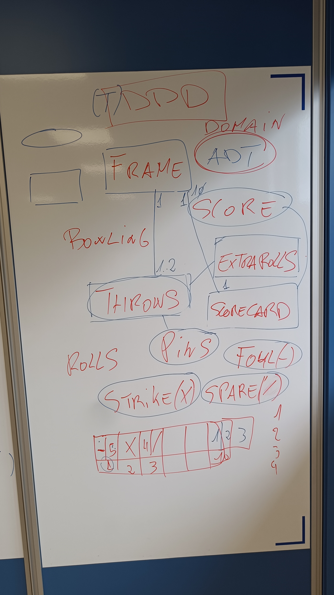

#  Kata Bowling game

1. [Introducción](#introducción)
2. [Requisitos del Sistema](#requisitos-del-sistema)
3. [Diseño de la Solución](#diseño-de-la-solución)
4. [Arquitectura Basada en DDD (Domain‑Driven Design)](#arquitectura-basada-en-ddd-domain-driven-design)
5. [Implementación Paso a Paso](#implementación-paso-a-paso)
6. [Casos de Prueba](#casos-de-prueba)
7. [Refactorización](#refactorización)
8. [Conclusiones](#conclusiones)
9. [Recursos y Referencias](#recursos-y-referencias)

## Introducción
Tomas Santiago Orellano - @T0T11 Jorge Pazos Domiguez - @jrgeepd
Somos alumnos de Desarollo de Aplicaciones Multiplataforma del IES de Teis. Hicimos este kata de @emilybache con el fin de afianzar el dominio de la programacion orientada a objetos

## Requisitos del Sistema
Requiere python = >=3.11 requiere pipx 1.8.0 o mayor Entorno virtual ( opcional, pero muy recomedable).Con el entorno Virtual ya instalado (python3 -m venv venv) y activado, tienes que escribir 
'''git clone https://github.com/jrgeepdbowling-game-kata y instalas las dependencias con el comando '''pip install -r requirements.txt

## Arquitectura basada en DDD

Siguiendo este esquema en el que se imparten las palabras que se usaran en el dominio con el fin de que todos estemos " en sintonia"

